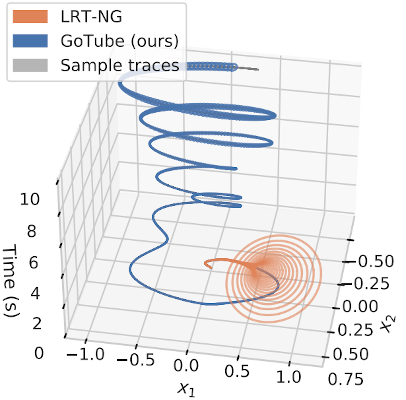

# GoTube -  Scalable Stochastic Verification of Continuous-Depth Models

GoTube constructs stochastic reachtubes (= the set of all reachable system states) of continuous-time systems. GoTube is made deliberately for the verification of countinuous-depth neural networks.


This document describes the general usage of GoTube. For the setup to reproduce the exact numbers reported in the paper have a look at the files ```table1.sh```, ```table2.sh```, and ```table3.sh```. 

## Setup

Requirement is Python3.6 or newer.
The setup was tested on Ubuntu 16.04, Ubuntu 20.04 and the recent MacOS machines with Python 3.6 and 3.8.

We recommend creating a virtual environment, for GoTube's dependencies to not interfere with other python installations.

```bash
python3 -m venv venv      # Optional
source venv/bin/activate  # Optional
pip3 -m pip install -r requirements.txt
```

## Benchmarks

Each Benchmark is encoded in a python class exposing three the attributes ```rad``` for the initial set radius, ```cx``` for the initial set center, and ```dim``` for the number of dimensions of the dynamical system.
Moreover, each benchmark class must implement a method ```fdyn``` that defines the dynamical system and a case in the ``get_model`` method for choosing that model via a parameter.
For example,

```python
# CartPole-v1 with a linear policy
class CartpoleLinear:
    
    def __init__(self, radius=None):
        
        #============ adapt initial values ===========
        self.cx = (0, 0, 0.001, 0) #initial values
        if radius is not None:
            self.rad = radius
        else:
            self.rad = 1e-4 #initial radius
        #===================================================
        
        self.cx = np.array(self.cx, dtype=float)
        self.dim = self.cx.size #dimension of the system
        
    def fdyn(self,t=0,x=None):
        
        if x is None:
            x=np.zeros(self.dim, dtype=object)
      
        #============ adapt input and system dynamics ===========
        dth, dx, th, x = x #input variables
              
        M = 1.0
        g = 9.81
        l = 1.0
        m = 0.001
        
        f = -1.1 * M * g * th - dth
    
        fdth = 1.0 / (l*(M+m*sin(th)*sin(th))) * (f * cos(th) - m*l*dth*dth*cos(th)*sin(th) + (m+M)*g*sin(th))
        fdx = 1.0 / (M+m*sin(th)*sin(th)) * ( f + m*sin(th) * (-l * dth*dth + g*cos(th)) )

        fx = dx

        fth = dth
        
        system_dynamics = [fdth, fdx, fth, fx] #has to be in the same order as the input variables
        #===================================================
        
        return np.array(system_dynamics) #return as numpy array
```
And inside the ``get_model`` method:
```
    elif benchmark == "cartpole":
        return CartpoleLinear(radius)  # Benchmark to run
```

## Running GoTube

The entry point of GoTube is defined in the file ```main.py```, which accepts several arguments to specify properties of the reachtube and GoTube.
The most notable arguments are:

- ```--benchmark``` Name of the benchmark (=dynamical system) for which the reachtube should be constructed
- ```--time_horizon``` Length in seconds of the reachtube to be constructed
- ```--time_step``` Intermediate time-points for which reachtube should be constructed
- ```--batch_size``` Batch size used for simulating points of the system. A large batch size speeds up the computation but adds additional memory footprints.
- ```--gamma``` Error probability. For instance, a gamma of 0.1 means the reachtube will have a 90% confidence.
- ```--mu``` Maximum multiplicative tolerance of over-approximation. A higher mu speeds up the computation of the bounding tube by in return increasing the average volume. For instance, a mu of 1.5 means the reachtube will have a 1.5 times larger radius than the most distant sample point.

## Examples

Create Van der Pol dynamical system reachtube for 2 seconds with a batch size of 100 samples, while creating intermediate reachsets every 0.1 seconds 

```bash
python main.py --time_horizon 2 --benchmark vdp --batch_size 100 --time_step 0.1
```

To create a 95% confidence reachtube for the CartPole-v1 with a CT-RNN and a maximum multiplicative tolerance of over-approximation mu of 1.5 run

```bash
python main.py --time_horizon 1 --benchmark cartpoleCTRNN --batch_size 10000 --time_step 0.02 --gamma 0.05 --mu 1.5
```

## Citation

```tex
TODO Add bibtex here
```
